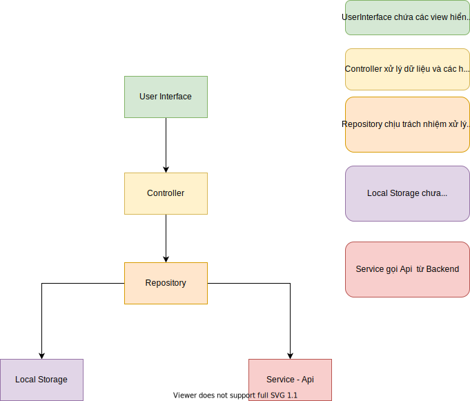

# Flutter Null Safety Architecture

## Plugin 

- [flutter_bloc](https://pub.dev/packages/flutter_bloc) State management

- [hive](https://pub.dev/packages/hive) Database save on the RAM

## Construction

- **fonts**: it contains all of the application's fonts

- **resources**: it contains all of the application's resources

- **assets**: this is where all assets files(eg: image, lacale,...)
- **bloc**: this is where all the bloc files are located

- **repository**: this is where all the repository files go to the service or the database 

- **room**: this is where all the configuration files for the database are located

- **ui**: this is where all the ui file for application are located

- **utils**; this is where all the util file for application are located

### Repository

